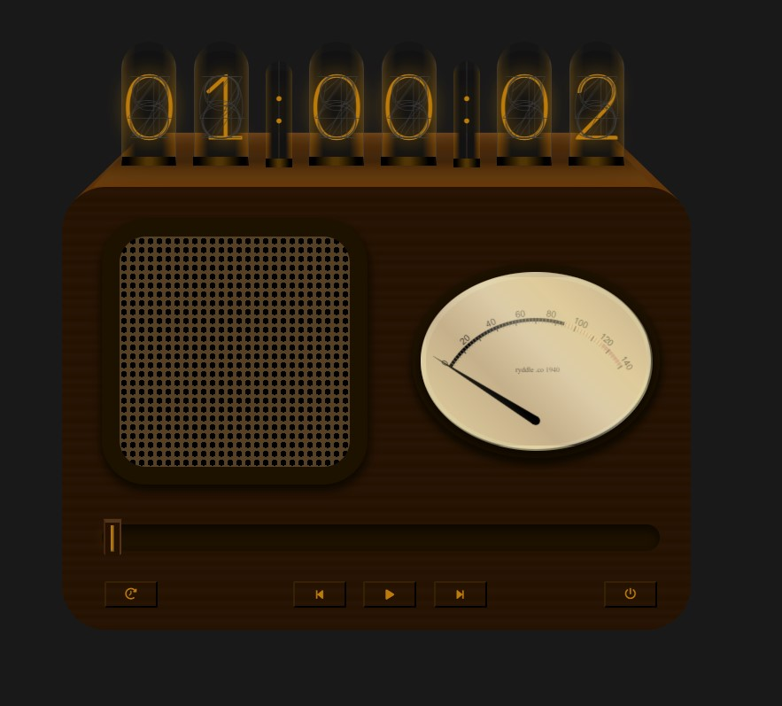

# nixie-radio

### Based on my [nixie-clock](https://github.com/ryddle/nixie-clock) forked from original project [qwerji](https://github.com/qwerji/nixie-clock)

### Gauge display from https://github.com/bernii/gauge.js

> A CSS/JavaScript minimalist local audio player imitating an old radio with [Nixie tubes](https://en.wikipedia.org/wiki/Nixie_tube).

## DEMO

https://ryddle.github.io/nixie-radio

### Version 1.1.0

### Version 2.0.0

